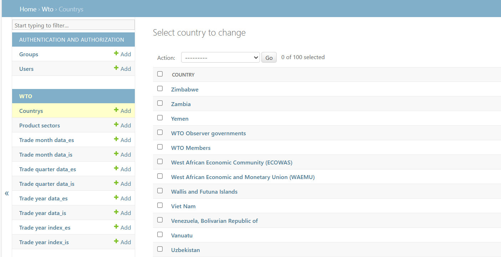
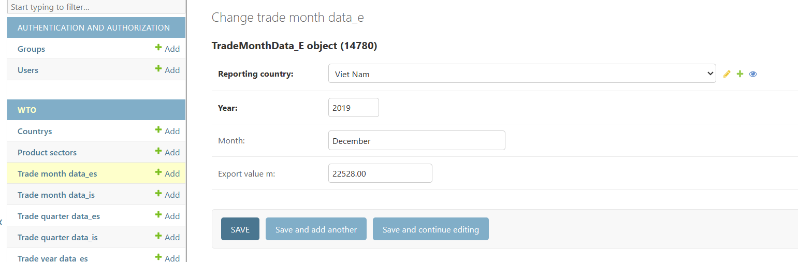
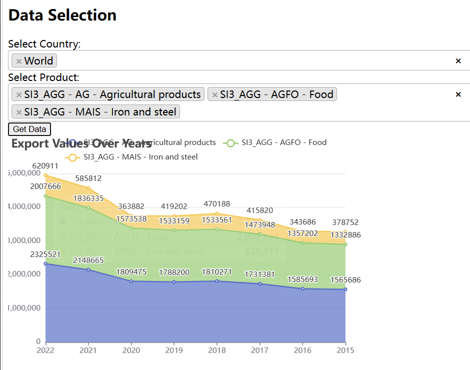
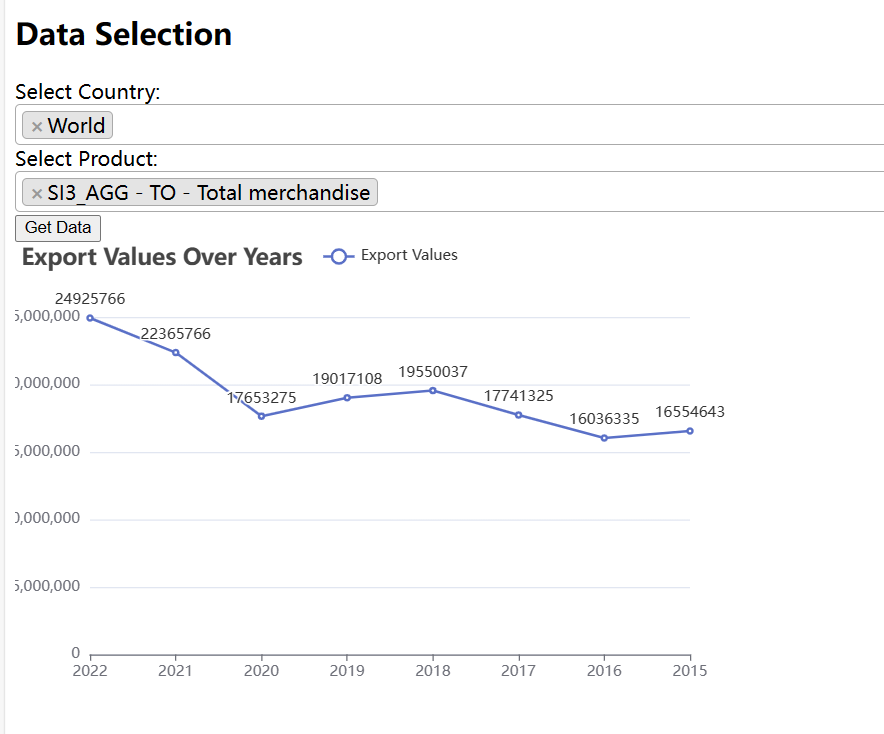
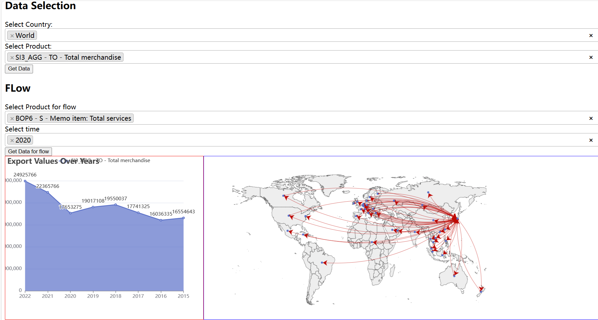
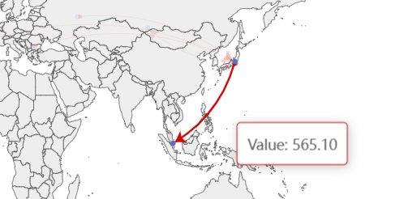
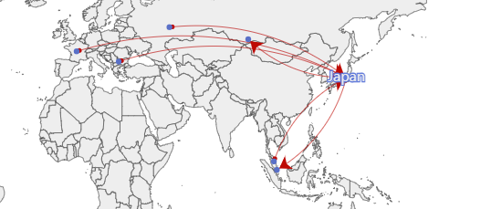

### A Djangle project for webgis 
2023.12.30

we can see the flows


2023.12.28

we can use it to create some simple graphs


2023.12.21

now it only loads some data


### Get Start
```
git clone [https://github.com/liangshanOral/WTO_WebGIS.git](https://github.com/liangshanOral/WTO_WebGIS.git)
```
配置环境
```
pip install -r requirements.txt
```
迁移数据库
```
python manage.py migrate
```
创建一个超级用户，从而可以查看数据
```
python manage.py createsuperuser
```
RUN！
```
python manage.py runserver
```
转到admin就可以查看数据库了


### 数据说明
data comes form WTO [https://stats.wto.org/]

it stores in .data

时间跨度 2022-2015

不同地区 不同类别 不同年份 年进出口量

不同地区 不同年份 季度、月进出口量 （但是有些不全）

不同地区 不同年份 进出口指数

<br>

大致效果






### 图表说明
目前仅用了一个指标数据

可以选择单国家多品类，多国家多品类形成折线图

<br>
大致效果





可以选择不同品类，不同年份形成流向图

点选某国家就只显示相关信息

<br>
大致效果




